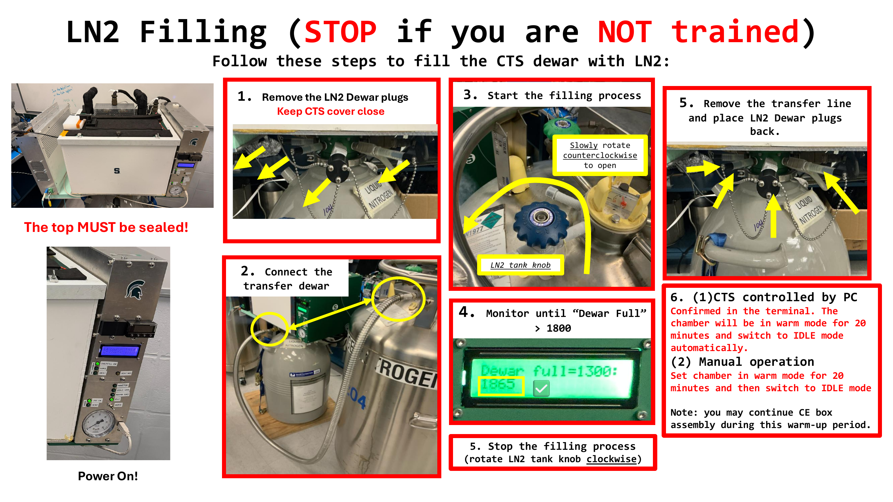
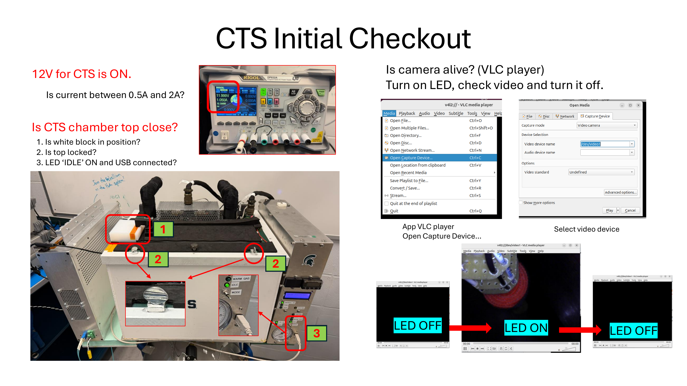
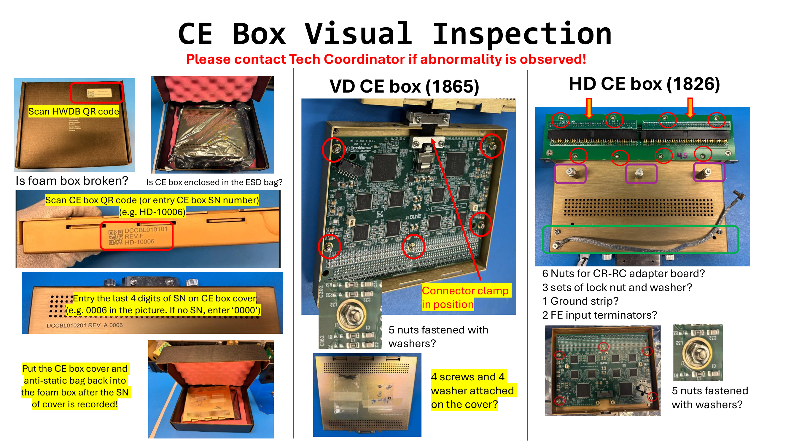
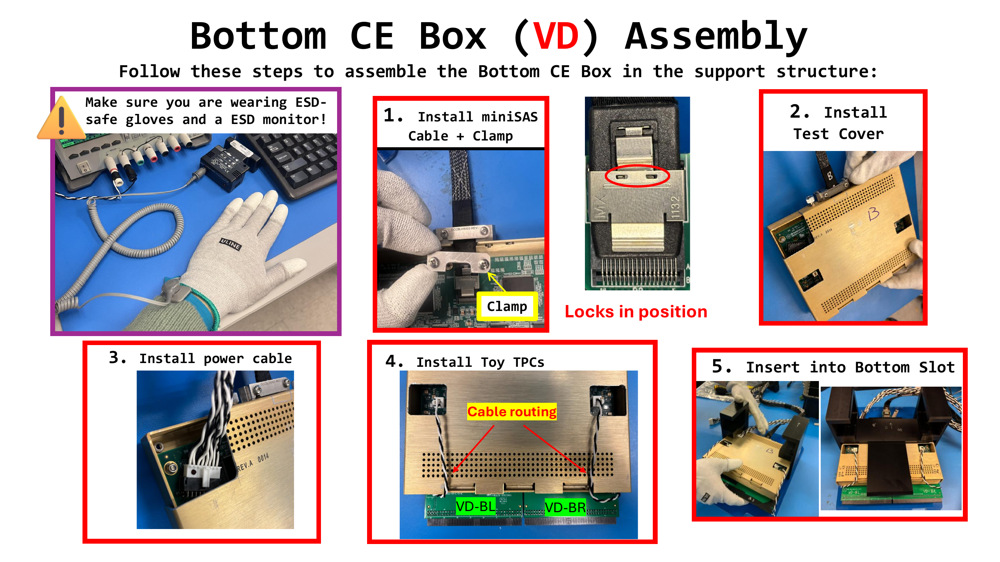
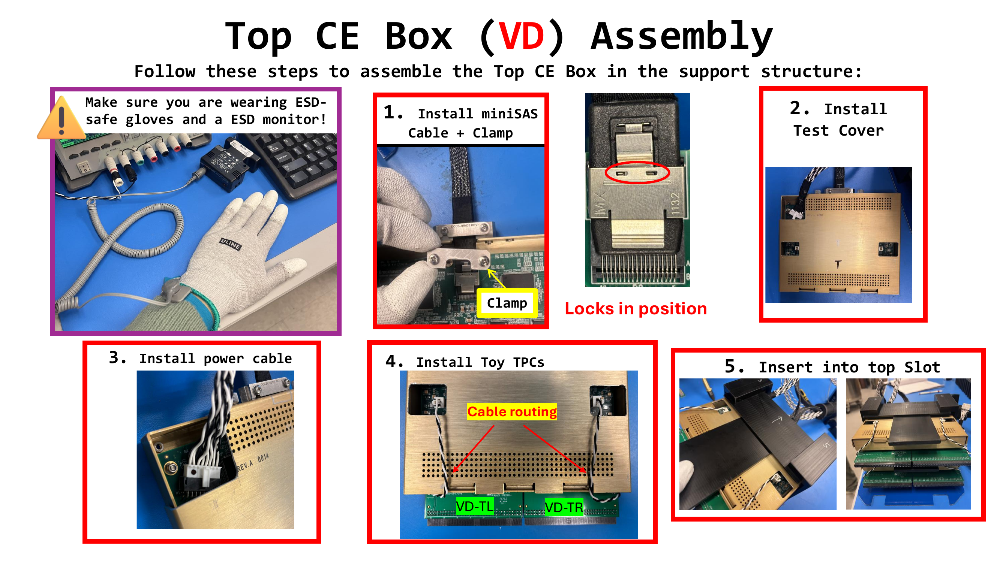
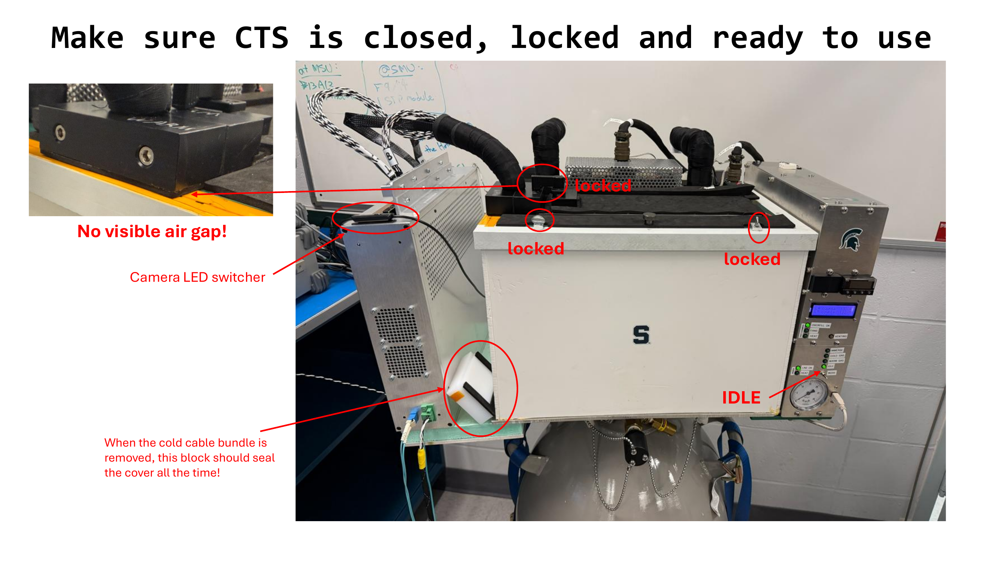

# CTS FEMB QC Test System Operation Guide

## Table of Contents
1. [System Overview](#system-overview)
2. [Pre-Test Preparation](#pre-test-preparation)
3. [Control Modes](#control-modes)
4. [Complete Test Workflow](#complete-test-workflow)
5. [New Features](#new-features)
6. [Troubleshooting](#troubleshooting)

---

## System Overview

### System Components
- **Test Host**: Runs QC test software
- **Power Supply**: Rigol DP800 programmable power supply (USB or Manual control)
- **CTS Cryogenic System**: Liquid nitrogen cooling system control box (USB or Manual control)
- **WIB Test Board**: Cold electronics test board
- **Network Storage**: Automatic test data backup

### Configuration File
All configuration parameters are set in `init_setup.csv`:
```csv
Test_Site,BNL
Tech_site_email,lke@bnl.gov
QC_data_root_folder,/mnt/data
Rigol_PS_ID,USB0::0x1AB1::0x0E11::DP8C184550857::INSTR
PS_Control_Mode,USB                    # USB=Automatic, MANUAL=Manual control
CTS_LN2_Fill_Wait,1800                 # LN₂ fill wait time (seconds)
CTS_Warmup_Wait,3600                   # Warm-up wait time (seconds)
Network_Upload_Path,/data/rtss/femb    # Network upload path
```

---

## Pre-Test Preparation

### 1. Hardware Connection Check
- [ ] Power supply connected to test host USB port
- [ ] CTS control box connected to test host USB port (usually `/dev/ttyACM*`)
- [ ] WIB test board installed in CTS test station
- [ ] Network connection available, network path accessible

### 2. Software Startup
```bash
cd /home/dune/Workspace/BNL_CE_WIB_SW_QC
python3 CTS_FEMB_QC_top.py
```

### 3. Initial Information Input
1. Enter operator name
2. Confirm email address
3. Review pre-check list (3 popup windows)


---

## Control Modes

The system supports two control modes, automatically switching based on hardware connection status:

### Power Supply Control Modes

#### 🤖 USB Automatic Mode
**Trigger Conditions**:
- `PS_Control_Mode=USB` in `init_setup.csv`
- Power supply USB connection successful

**Automatic Operations**:
- ✅ Auto-set voltage and current
- ✅ Auto turn ON/OFF outputs
- ✅ Auto measure voltage and current
- ✅ Auto verify power-off state

**User Action**: No manual operation required

---

#### 👤 Manual Control Mode
**Trigger Conditions**:
- `PS_Control_Mode=MANUAL` in `init_setup.csv`
- OR USB connection failed

**Prompt Example**:
```
======================================================================
[MANUAL POWER CONTROL] Please configure power supply:
  Channel: CH1
  Voltage: 12.0 V
  Current Limit: 3.0 A
  Action: Turn OUTPUT ON
======================================================================
Press ENTER after you have completed this configuration >>
```

**User Operations**:
1. Manually set parameters on power supply panel
2. Manually turn ON/OFF output
3. Manually read and input measurement values
4. Press ENTER to confirm completion

---

### CTS Cryogenic System Control Modes

#### 🤖 Automatic Control Mode
**Trigger Condition**: CTS control box USB connection successful (usually `/dev/ttyACM1`)

**Automatic Operations**:
- ✅ Auto-read dewar level
- ✅ Auto cold gas pre-cooling (5 minutes) with countdown animation
- ✅ Auto LN₂ fill with level monitoring and progress display
- ✅ Auto detect level reaching Level 3 or 4
- ✅ Auto warm gas purge (20 or 60 minutes) with countdown animation
- ✅ Auto return to IDLE state

**Countdown Animation Example**:
```
======================================================================
  CTS Warm Gas Purge (20 min)
  Press 'j' to skip wait
======================================================================

⠹ [████████████████░░░░░░░░░░░░░░░░░░░░░░░░] 40.5% 11:54 remaining
```

**User Operations**:
- Manually refill LN₂ when level is insufficient
- Press 'Y' to confirm refill completion
- Press 'j' to skip any countdown timer

---

#### 👤 Manual Control Mode
**Trigger Condition**: CTS control box USB connection failed or unavailable

**Prompt Example**:
```
======================================================================
  MANUAL CTS CONTROL INSTRUCTIONS
======================================================================
Step 1: Cold Gas Pre-cooling (~5 minutes)
  1. Set CTS to STATE 3 (Cold Gas)
  2. Wait for countdown (can press 'j' to skip)

⠹ [████████░░░░░░░░░░░░░░░░░░░░] 20.3% 03:59 remaining
```

**User Operations**:
1. Manually set CTS state on control box:
   - STATE 1: IDLE
   - STATE 2: Warm Gas
   - STATE 3: Cold Gas
   - STATE 4: LN₂ Immersion
2. Wait for countdown timer (system displays animated countdown)
3. Press 'j' to skip wait if needed
4. Confirm completion when prompted

---

## Complete Test Workflow

### Phase 0: System Initialization

#### 🤖 Automatic: CTS System Initialization
```
==================================================================
  CTS CRYOGENIC SYSTEM INITIALIZATION
==================================================================
Configuration:
  LN₂ Fill Wait Time: 30 minutes
  Warm-up Wait Time: 60 minutes

✓ CTS cryogenic box connected via USB - automatic control enabled
==================================================================
```

**Result**:
- ✅ Automatic: System displays "USB - automatic control enabled"
- ⚠️  Manual: System displays "manual control mode"

---

#### 🤖 Automatic: Dewar Level Check
**Morning Shift (1:00-11:00)**: Required level ≥ 1700
**Evening Shift (12:00-0:00)**: Required level ≥ 1200

**Automatic Mode Flow**:
```
Current Shift: Morning
Required Dewar Level: >= 1700
ℹ Checking dewar level via CTS...
Current Dewar Level: 1850
✓ Dewar level (1850) is sufficient for Morning shift
```

**When Level Insufficient**:
1. 🖥️ **Auto**: System detects level < threshold
2. 🖥️ **Auto**: Popup refill instruction image
3. 👤 **Manual**: Refill 50L dewar with liquid nitrogen
4. 👤 **Manual**: Enter 'Y' to confirm refill complete
5. 🖥️ **Auto**: Re-check level
6. 🖥️ **Auto**: If still insufficient, repeat refill process
7. 🖥️ **Auto**: Once sufficient, automatic warm gas purge for 20 minutes with countdown animation



---

### Phase 1: FEMB Installation & Setup

#### 👤 Manual: Assembly Data Collection



**Bottom Slot**:
1. 👤 Input whether FEMB will be installed (Y/EMPTY/N)
   - **Input Validation**: Only accepts 'Y', 'YES', 'EMPTY', 'NONE', 'N', 'NO'
   - **Invalid Input**: System prompts "Invalid input. Please enter 'Y', 'EMPTY', or 'N'" and loops
2. 👤 Scan/Enter HWDB QR code (on foam box)
3. 👤 Scan/Enter CE box serial number
4. 👤 Enter CE box cover last 4 digits
5. 🖥️ **Auto Validation**: Cover digits must match CE box last 4 digits
6. 👤 Scan FEMB QR code (triple verification)



**Top Slot**: Repeat above steps

**Example**:
```
Will this slot have a FEMB installed?
(Enter 'Y' for Yes, 'EMPTY' or 'N' if this slot will be empty)
>> Y

Scan HWDB QR code on foam box
>> A12345

Scan/Enter CE box serial number
>> ZZZ9876

Enter last 4 digits on CE box cover
>> 9876
✓ Cover matches CE box

Scan FEMB QR code (1st scan)
>> FEMB001
Scan FEMB QR code (2nd scan)
>> FEMB001
✓ FEMB verified and registered
```

---

### Phase 2: Configuration & Documentation

#### 👤 Manual: Photo Documentation
1. 🖥️ **Auto**: Display photo prompt popup
2. 👤 **Manual**: Take photos of CE boxes with camera
3. 👤 **Manual**: Select photo files to upload
4. 🖥️ **Auto**: Save photos to test records



#### 🖥️ Auto: Generate Configuration Files
- ✅ Create `femb_info_implement.csv`
- ✅ Save all FEMB IDs and slot information
- ✅ Save assembly traceability data

#### 📧 Email Notification: Assembly Complete
```
Subject: Assembly Complete - Ready for QC - BNL
Body:
  Assembly phase completed successfully.
  All FEMBs are installed and ready for testing.

  Next Step: Proceed to Warm QC testing (Phase 3)
```

---

### Phase 3: Warm QC Test



#### 🤖 Automatic: Power Control (USB Mode)
```
▶ [1/4] Powering ON WIB
✓ CH1: 12.0V, 3.0A - OUTPUT ON
✓ CH2: 12.0V, 3.0A - OUTPUT ON
ℹ Initializing ethernet link (35 seconds)...
```

#### 👤 Manual: Power Control (Manual Mode)
```
======================================================================
[MANUAL POWER CONTROL] Please configure power supply:
  Channel: CH1
  Voltage: 12.0 V
  Current Limit: 3.0 A
  Action: Turn OUTPUT ON
======================================================================
Press ENTER after configuration >> [Wait for user input]
```

#### 🖥️ Automatic: Test Execution
1. ✅ WIB connection test
2. ✅ WIB initialization
3. ✅ FEMB Warm Checkout (up to 3 auto-retries)
4. ✅ FEMB Warm QC test (~30 min)

#### 🖥️ Automatic: Result Analysis
```
==================================================================
  WARM QC TEST - TEST RESULTS
==================================================================

📊 Test Summary:
   Total Fault Files: 0
   Total Pass Files:  24

🔍 FEMB Status by Slot:
   ✓ Bottom Slot0: FEMB FEMB001 - PASS
      Files: 0 faults, 12 passes
   ✓ Top Slot1: FEMB FEMB002 - PASS
      Files: 0 faults, 12 passes

==================================================================
  ✓✓✓ OVERALL RESULT: PASS ✓✓✓
==================================================================
```

**Failure Handling**:
```
✗✗✗ OVERALL RESULT: FAIL ✗✗✗

⚠️  Test failed. What would you like to do?
  'r' - Retry the test (~30 min)
  'c' - Continue anyway (not recommended)
  'e' - Exit and proceed to disassembly
>>
```
- **Input Validation**: Only accepts 'r', 'c', or 'e'
- **Invalid Input**: System prompts "Invalid input. Please enter 'r', 'c', or 'e'" and loops

#### 📧 Email Notification: Warm QC Complete
```
Subject: Warm QC Complete - BNL
Attachments: Warm_QC_Summary_20260115_143022.txt

Body:
  Warm QC Test Completed - Ready for Cold Down

  Test Site: BNL
  Timestamp: 2026-01-15 14:30:22

  Summary:
    Total Fault Files: 0
    Total Pass Files: 24
    Overall Result: PASS

  Next Steps:
    1. Switch CTS to COLD mode for 5 minutes
    2. Switch to IMMERSE mode
    3. Wait for LN2 to reach Level 3
    4. Double confirm heat LED is OFF

  Detailed summary is attached.
```

---

### Phase 4: Cold QC Test

#### 🤖 Automatic: CTS Cool Down (Automatic Mode)
```
🌡️  Initiating CTS cool down procedure...
ℹ Automatic CTS control enabled

▶ [1/3] Cold gas pre-cooling

======================================================================
  CTS Cold Gas Pre-cooling (5 min)
  Press 'j' to skip wait
======================================================================

⠋ [██████████░░░░░░░░░░░░░░░░░░░░] 25.1% 03:44 remaining

✓ Wait complete!

▶ [2/3] LN₂ immersion with level monitoring

======================================================================
  CTS LN₂ Immersion (~30 min)
  Monitoring level every 60 seconds...
======================================================================

[Check 1]  1 min elapsed | Chamber Level: 1 (Filling) | Dewar: 1850
[Check 2]  2 min elapsed | Chamber Level: 2 (In Progress) | Dewar: 1820
[Check 20] 20 min elapsed | Chamber Level: 3 (✓ Ready) | Dewar: 1650

✓ LN₂ in chamber reached Level 3 - Ready for cold test!

▶ [3/3] Checking CTS status
✓ Chamber Level: 3, Dewar Level: 1650
```

#### 👤 Manual: CTS Cool Down (Manual Mode)
```
======================================================================
  MANUAL CTS CONTROL INSTRUCTIONS
======================================================================
Step 1: Cold Gas Pre-cooling (~5 minutes)
  1. Set CTS to STATE 3 (Cold Gas)
  2. Wait for countdown

Have you set CTS to STATE 3 (Cold Gas)?
Enter 'Y' when ready
>> Y
✓ Cold gas mode confirmed

======================================================================
  CTS Cold Gas Pre-cooling (5 min)
  Press 'j' to skip wait
======================================================================

⠙ [████████████████████████░░░░░░░░] 60.2% 01:59 remaining

✓ Wait complete!

Step 2: LN₂ Immersion (~30 minutes)
  1. Set CTS to STATE 4 (LN₂ Immersion)
  2. Wait for LN₂ to reach LEVEL 3 or 4
  3. Monitor level sensors every few minutes

⏰ Wait for LN2 Refill (~30 min)!
[Countdown timer with skip option]
✅ Timer complete!

⚠️  Please verify CTS is fully cooled down:
   • LN₂ level has reached LEVEL 3 or 4
   • Heat LED is OFF

Type 'confirm' to continue, or 'j' to skip
>> confirm
✓ CTS cool down confirmed
```

#### 🖥️ Automatic: Cold Test Execution
1. ✅ Pre-test level monitoring check
2. ✅ FEMB Cold Checkout (up to 3 auto-retries)
3. ✅ FEMB Cold QC test (~30 min)
4. ✅ Post-test level monitoring check
5. ✅ Result analysis (same format as Phase 3)

#### 📧 Email Notification: Cold QC Complete
```
Subject: Cold QC Complete - BNL
Attachments: Cold_QC_Summary_20260115_163045.txt

Body:
  Cold QC Test Completed - Ready for Warm-Up

  Test Site: BNL
  Timestamp: 2026-01-15 16:30:45

  Summary:
    Total Fault Files: 0
    Total Pass Files: 24
    Overall Result: PASS

  Next Step:
    Please perform the warm-up procedure (60 minutes)

  Detailed summary is attached.
```

---

#### 🤖 Automatic: CTS Warm-Up (Automatic Mode)
```
==================================================================
  CTS WARM-UP PROCEDURE
==================================================================
ℹ Automatic CTS warm-up control enabled

▶ CTS warm gas purge

======================================================================
  CTS Warm Gas Purge (60 min)
  Press 'j' to skip wait
======================================================================

⠸ [████████████████████░░░░░░░░░░░░] 50.8% 29:30 remaining

✓ Wait complete!

✓ CTS warm-up completed successfully
✓ CTS set to IDLE state
==================================================================
```

#### 👤 Manual: CTS Warm-Up (Manual Mode)
```
======================================================================
  MANUAL CTS WARM-UP INSTRUCTIONS
======================================================================
Step 1: Set CTS to Warm Gas mode
  1. Set CTS to STATE 2 (Warm Gas)
  2. Wait for countdown (you can skip with 'j')
  3. After countdown, set CTS back to STATE 1 (IDLE)

Have you set CTS to STATE 2 (Warm Gas)?
Enter 'Y' when ready
>> Y
✓ Warm gas mode confirmed

======================================================================
  CTS Warm Gas Purge (20 min)
  Press 'j' to skip wait
======================================================================

⠴ [████████████░░░░░░░░░░░░░░░░░░░░] 30.5% 13:54 remaining

✓ Wait complete!

⚠️  Please set CTS to STATE 1 (IDLE)
Enter 'Y' when CTS is set to IDLE
>> Y
✓ CTS warm gas purge completed

Step 2: Return CTS to IDLE state
  1. Set CTS to STATE 1 (IDLE)

Have you set CTS to STATE 1 (IDLE)?
Enter 'Y' when ready, or 'j' to skip
>> Y
✓ CTS warm-up complete
==================================================================
```

---

### Phase 5: Final Checkout

Same workflow as Phase 3:
- 🤖 Power control (Automatic/Manual)
- 🖥️ Final Checkout test (up to 3 auto-retries)
- 🖥️ Result analysis

#### 📧 Email Notification: QC Complete
```
Subject: QC Complete - Please Classify - BNL
Attachments: Overall_QC_Summary_20260115_181522.txt

Body:
  QC Testing Complete - Ready for Classification

  Test Site: BNL
  Completion Time: 2026-01-15 18:15:22

  OVERALL TEST SUMMARY:
  =====================
    Total Fault Files: 0
    Total Pass Files: 72
    Overall Result: ✓ PASS

  FEMB Results:
    Bottom Slot0: FEMB001 - PASS
    Top Slot1: FEMB002 - PASS

  Next Steps:
    1. Power OFF the WIB
    2. Proceed to disassembly and classification
    3. Store FEMBs according to test results

  Detailed comprehensive summary is attached.
```

---

### Phase 6: Disassembly & Labeling



#### 👤 Manual: Disassembly Validation

**Step 1: Disassemble TOP Slot**
1. Display disassembly instructions
2. Remove FEMB from CE box

**Step 2: Disassemble BOTTOM Slot**
1. Display disassembly instructions
2. Remove FEMB from CE box

**Step 3: Packaging Validation**

For each slot (TOP first, then BOTTOM):

1. **Scan CE Box Verification**
   ```
   📦 PACKAGING TOP SLOT

   Please scan CE box QR code to verify
   Scan or type CE box SN: >> ZZZ9876
   ✓ CE box SN matches: ZZZ9876
   ```

2. **Install Cover Verification**
   ```
   ======================================================================
         >>> Please install COVER (last 4: 9876) <<<
         >>> To CE BOX SN: ZZZ9876 <<<
   ======================================================================
   After cover is installed, type cover last 4 digits: >> 9876
   ✓ Cover SN matches: 9876
   ```

3. **Foam Box Packaging Verification**
   ```
   ======================================================================
         >>> Please package CE BOX (ZZZ9876) <<<
         >>> Into FOAM BOX QR: A12345 <<<
   ======================================================================
   Scan QR code on the foam box: >> A12345
   ✓ Foam box matches: A12345
   ```

4. **QC Result Sticker**
   ```
   FEMB ID: FEMB001
   >>> Put on Green 'PASS' sticker near HWDB QR sticker <<<
   ```
   OR
   ```
   FEMB ID: FEMB003
   >>> Put on Red 'NG' sticker near HWDB QR sticker <<<
   ```

5. **Storage Confirmation**
   ```
   Store the foam box in the designated location.
   ✓ TOP slot CE box disassembly validation complete!
   ```

**Step 4: Accessory Return Confirmation**


```
⚠️  Please confirm all accessories have been returned to their original positions.
Type 'confirm' to continue
>> confirm
✓ Accessories check completed. Thank you!
```

---

#### 🖥️ Automatic: FEMB Labeling Guide
```
==================================================================
  📋 FEMB LABELING INSTRUCTIONS
==================================================================

Please label the FEMB boards according to test results:

✓ Bottom Slot0: FEMB FEMB001 - PASS
   >>> Put on Green 'PASS' sticker near HWDB QR sticker <<<

✓ Top Slot1: FEMB FEMB002 - PASS
   >>> Put on Green 'PASS' sticker near HWDB QR sticker <<<

==================================================================
```

---

#### 🖥️ Automatic: Real-Time Network Sync

**During Test Execution**:
```
📤 Syncing Warm QC data to network...
  ✓ Data synced to /data/rtss/femb/FEMB_QC/...
  ✓ Report synced
```

**After Phase 6 Completion**:
```
==================================================================
  UPLOADING TEST DATA TO NETWORK DRIVE
==================================================================
Source: /mnt/data
Destination: /data/rtss/femb

ℹ Copying FEMB_QC data...
✓ Copied FEMB_QC (156 files)
✓ Copied femb_info.csv
✓ Copied femb_info_implement.csv

==================================================================
  UPLOAD COMPLETE
==================================================================
  ✓ Files uploaded: 158
  ✓ Total size: 245.67 MB
  ✓ Location: /data/rtss/femb
==================================================================

✓ All test data uploaded successfully
```

**If Upload Fails**:
```
⚠️ Upload failed or incomplete - please upload manually
  Manual upload: Copy data from /mnt/data/FEMB_QC to /data/rtss/femb
```

---

## New Features

### 1. Input Validation Loops
All user inputs now validate automatically:

**Example - Slot Status Input**:
```
Will this slot have a FEMB installed?
(Enter 'Y' for Yes, 'EMPTY' or 'N' if this slot will be empty)
>> xyz
✗ Invalid input. Please enter 'Y', 'EMPTY', or 'N'
>> Y
✓ Input accepted
```

**Validated Inputs**:
- Slot installation status (Y/EMPTY/N)
- Dewar level checks (Y/N)
- FEMB confirmation (y/n)
- Configuration modification (m/confirm)
- QC action selections (y/s/e)
- Test failure decisions (r/c/e)
- Final result review (y/n)

### 2. Countdown Timer with Animation

**Visual Features**:
- 🔄 Spinning animation (⠋⠙⠹⠸⠼⠴⠦⠧⠇⠏)
- 📊 Color-coded progress bar `[████████░░░░] 45.2%`
- ⏱️ Live remaining time display `05:23 remaining`
- ⏭️ Skip option - Press **'j'** to skip any wait

**Example Display**:
```
======================================================================
  CTS Warm Gas Purge (20 min)
  Press 'j' to skip wait
======================================================================

⠹ [████████████████░░░░░░░░░░░░░░░░░░░░░░░░] 40.5% 11:54 remaining

[Press 'j' to skip]
```

**Available in**:
- Phase 0: Warm gas purge (20 min) - USB automatic mode
- Phase 0: Warm gas purge (20 min) - Manual mode
- Phase 4: Cold gas pre-cooling (5 min) - USB automatic mode
- Phase 4: Cold gas pre-cooling (5 min) - Manual mode
- Phase 4: Warm-up (60 min) - USB automatic mode

### 3. Enhanced LN₂ Level Monitoring

**Color-Coded Progress Display**:
```
======================================================================
  CTS LN₂ Immersion (~30 min)
  Monitoring level every 60 seconds...
======================================================================

[Check 1]  1 min elapsed | Chamber Level: 1 (Filling) | Dewar: 1850
[Check 5]  5 min elapsed | Chamber Level: 2 (In Progress) | Dewar: 1800
[Check 15] 15 min elapsed | Chamber Level: 3 (✓ Ready) | Dewar: 1650

✓ LN₂ in chamber reached Level 3 - Ready for cold test!
```

**Status Colors**:
- 🔴 **Red** "Filling" - Level 0-1
- 🟡 **Yellow** "In Progress" - Level 2
- 🟢 **Green** "✓ Ready" - Level 3-4

### 4. Email Notifications

**Four Automatic Emails**:

1. **Assembly Complete** (After Phase 2)
   - Subject: "Assembly Complete - Ready for QC"
   - Content: Assembly phase completed, ready for testing

2. **Warm QC Complete** (After Phase 3)
   - Subject: "Warm QC Complete"
   - Attachment: Warm_QC_Summary.txt
   - Content: Test results summary + next steps for cold down

3. **Cold QC Complete** (After Phase 4)
   - Subject: "Cold QC Complete"
   - Attachment: Cold_QC_Summary.txt
   - Content: Test results summary + warm-up instructions

4. **QC Complete** (After Phase 5)
   - Subject: "QC Complete - Please Classify"
   - Attachment: Overall_QC_Summary.txt
   - Content: Complete test summary with pass/fail for each FEMB

### 5. Real-Time Network Synchronization

**Features**:
- Data and reports sync to network immediately after local save
- Syncs to `/data/rtss/femb/FEMB_QC`
- No manual upload needed
- Automatic retry on failure

**Sync Points**:
- After Warm QC data transfer
- After Cold QC data transfer
- After Final Checkout data transfer
- Final comprehensive upload at Phase 6

---

## Troubleshooting

### Power Supply Issues

#### Issue: Cannot Connect to Power Supply
**Symptoms**:
```
❌ Connection failed: No such resource
⚠️ Rigol device not found via USB
```

**Solutions**:
1. Check USB connection
2. Run `lsusb` to view devices (should show `1ab1:0e11 Rigol Technologies`)
3. If not detected:
   - Restart power supply
   - Re-plug USB cable
   - Change USB port
4. If still unable to connect:
   - Modify `init_setup.csv`: `PS_Control_Mode,MANUAL`
   - Restart test program
   - System will switch to manual control mode

---

### CTS Control Box Issues

#### Issue: Cannot Find CTS Control Box
**Symptoms**:
```
No available serial port exists
Can't build communication with CTS
```

**Solutions**:
1. Check USB connection
2. Run `ls /dev/ttyACM*` to view serial devices
3. Follow on-screen prompts:
   ```
   step 1: Power off cold control box
   step 2: Unplug USB cable from cold control box
   step 3: Wait 5 seconds
   step 4: Turn cold control box back on
   step 5: Replug USB cable to cold control box
   fixed? (y/n):
   ```
4. If still unable to connect, select 'n' to enter manual control mode

---

### Level Check Failure

#### Issue: Level Still Insufficient After Refill
**Symptoms**:
```
✗ Dewar level (1150) is still below threshold (1700)
⚠️  Refill was insufficient. Please refill again.
```

**Solutions**:
1. Check if dewar is actually filled
2. Check if LN₂ is evaporating (insulation good?)
3. Continue refilling until level is sufficient
4. System will automatically loop until check passes

---

### Test Failure Handling

#### Warm/Cold Checkout Failure
**Auto-Retry**: System automatically retries up to 3 times

**After 3 Failures**: Continues to QC test but sends email notification

#### QC Test Failure
**Options**:
- `'r'` - Retry test (~30 minutes)
- `'c'` - Continue to next phase (not recommended)
- `'e'` - Exit test, proceed to warm-up and disassembly

---

### Network Upload Failure

#### Issue: Cannot Access Network Path
**Symptoms**:
```
✗ Failed to create network directory: Permission denied
```

**Solutions**:
1. Check network connection: `ping [network server]`
2. Check mount: `mount | grep /data`
3. Check permissions: `ls -ld /data/rtss/femb`
4. Manual upload:
   ```bash
   cp -r /mnt/data/FEMB_QC /data/rtss/femb/
   cp femb_info*.csv /data/rtss/femb/
   ```

---

## Test Time Estimates

### Complete Test Cycle (Automatic Mode)
| Phase | Estimated Time | Notes |
|-------|---------------|-------|
| Phase 0: Initialization | 5-10 min | With level check, +40 min if refill needed |
| Phase 1: Installation | 15-20 min | Manual assembly and scanning |
| Phase 2: Configuration | 5 min | Photos and config |
| Phase 3: Warm QC | 30-40 min | Including retries |
| Phase 4: Cold QC | 90-120 min | Including cooling, test, warm-up |
| Phase 5: Final Checkout | 30-35 min | |
| Phase 6: Disassembly | 15-20 min | Manual operations |
| **Total** | **3-4 hours** | Excluding additional LN₂ refills |

### Time Savings (Automatic vs Manual)
| Operation | Automatic Mode | Manual Mode | Time Saved |
|-----------|---------------|-------------|------------|
| Power Control | Automatic | ~2 min/time × 10 times | ~20 min |
| CTS Control | Automatic | ~3 min/time × 5 times | ~15 min |
| Level Monitoring | Automatic | Manual checks needed | ~10 min |
| **Total Savings** | | | **~45 min/test** |

---

## Appendix

### A. CTS State Codes
| State | Name | Function |
|-------|------|----------|
| STATE 1 | IDLE | Standby mode |
| STATE 2 | Warm Gas | Warm gas purge (warm-up) |
| STATE 3 | Cold Gas | Cold gas pre-cooling |
| STATE 4 | LN₂ Immersion | Liquid nitrogen immersion mode |

### B. Level Sensor Grades
| Level | ADC Range | Status |
|-------|-----------|--------|
| 0 | < 10000 | Short circuit/abnormal |
| 1 | 10000-16000 | Room temperature |
| 2 | 16000-18400 | In cold gas |
| 3 | 18400-25000 | LN₂ immersed |
| 4+ | > 25000 | Open circuit/overflow |

### C. Dewar Level Thresholds
| Shift | Time Period | Minimum Level |
|-------|------------|---------------|
| Morning | 1:00-11:00 | 1700 |
| Evening | 12:00-0:00 | 1200 |

### D. Common Commands
```bash
# View USB devices
lsusb

# View serial devices
ls /dev/ttyACM*

# Check network mounts
mount | grep /data

# View test data
ls -lh /mnt/data/FEMB_QC/

# Manual copy to network
cp -r /mnt/data/FEMB_QC /data/rtss/femb/
```

### E. Skip Options Summary
All countdown timers support pressing **'j'** to skip:

| Wait Type | Duration | Location | Skip Key |
|-----------|----------|----------|----------|
| Warm Gas Purge (Auto) | 20-60 min | Phase 0, Phase 4 | 'j' |
| Warm Gas Purge (Manual) | 20-60 min | Phase 0, Phase 4 | 'j' |
| Cold Gas Pre-cool (Auto) | 5 min | Phase 4 | 'j' |
| Cold Gas Pre-cool (Manual) | 5 min | Phase 4 | 'j' |
| LN₂ Fill Timer (Manual) | 30 min | Phase 4 | 's' or 'stop' |
| Warm-up Timer (Manual) | 60 min | Phase 4 | 's' or 'stop' |

---

**Document Version**: v2.0
**Last Updated**: 2026-01-15
**Maintained By**: BNL QC Team
