# CE Agent QC — 系统流程图

FEMB QC 自然语言驱动系统，位于 `femb_qc_nlp/`。

---

## 整体架构

```
┌─────────────────────────────────────────────────────────────────┐
│                         femb_qc_nlp/                            │
│                                                                 │
│   main.py          ← 入口，sys.path 配置，交互循环               │
│   agent/           ← NL 解析 + 意图分发层                       │
│   core/            ← SSH 控制 + 数据分析层                      │
│   scripts/         ← WIB 端原子脚本（SCP 推送后在 WIB 执行）     │
│   config/          ← femb_info_implement.csv                    │
│   data/            ← 本地采集数据 + manifest                    │
│   ssh_commands/    ← 每次采集生成的完整 .sh 脚本                 │
└─────────────────────────────────────────────────────────────────┘
```

---

## 完整执行流程

```mermaid
flowchart TD
    %% ── 入口 ──────────────────────────────────────────────────────
    A([用户输入\n交互模式 / 单次命令]) --> B

    subgraph MAIN["main.py"]
        B[sys.path 加入\nfemb_qc_nlp/ 和\nBNL_CE_WIB_SW_QC/]
        B --> C[FEMBNLAgent 初始化\n加载 femb_function_registry.json]
    end

    C --> D

    %% ── NL 解析层 ─────────────────────────────────────────────────
    subgraph AGENT["agent/femb_nl_agent.py  —  FEMBNLAgent"]
        D[execute\nuser_input] --> E

        subgraph PARSE["parse_intent()"]
            E[构建 messages\nsystem_prompt + few_shots\n+ user_input] --> F
            F["_call_ollama()\nPOST /api/chat\nmodel=qwen3:8b\nthink=False\nnum_predict=400\ntimeout=300s"] --> G
            G[解析 JSON 响应\nintent_dict]
        end

        G --> H

        subgraph PREVIEW["core/femb_config_preview.py"]
            H[confirm_config\n生成 config_preview_*.txt\n显示完整参数预览] --> I{用户确认\ny / e / n}
            I -- e --> H
            I -- n --> Z1([取消退出])
            I -- y --> J
        end

        J[_map_intent_to_action\nintent → callable] --> K

        subgraph DISPATCH["意图分发"]
            K{intent}
            K -- run_single --> L1[_action_run_single_config]
            K -- run_rms --> L2[_action_run_full_rms]
            K -- run_and_analyze --> L3[_action_run_and_analyze]
            K -- analyze_rms --> L4[_action_analyze_rms]
            K -- power_on --> L5[_action_power_on]
            K -- power_off --> L6[_action_power_off]
        end
    end

    %% ── SSH 控制层 ────────────────────────────────────────────────
    subgraph SSH["core/femb_ssh_lib.py"]

        subgraph SINGLE["run_single_config(slots, snc, sg, st, ...)"]
            M0[构建所有步骤列表\ninit_steps / power_steps\natom steps] --> M1
            M1["save_ssh_commands()\n生成 ssh_commands/ssh_cmd_*.sh\nSection 0~5 完整记录"] --> M2

            subgraph INIT["Layer 0 — wib_init()"]
                M2[wib_time_sync\nSSH: date -s 'UTC'] --> M3
                M3[wib_startup\nSSH: python3 wib_startup.py\n等待 Done] --> M4
                M4{cfg_push\nfemb_info_implement.csv\n是否存在?}
                M4 -- 存在 --> M4A[SCP push → WIB\nSCP readback ← WIB\nfilecmp 校验]
                M4 -- 不存在 --> M4B[WARNING 跳过]
            end

            M4A --> M5
            M4B --> M5

            subgraph POWER["Layer 1 — femb_power_on(slots, env)"]
                M5{env == LN?}
                M5 -- 是 --> M5A[SSH: top_femb_powering_LN.py\non/off × 4\nsleep 2s]
                M5 -- 否 --> M5B
                M5A --> M5B[SSH: top_femb_powering.py\non/off × 4\n检查 SLOT#N Power Connection Normal]
            end

            M5B --> M6[push_atoms_to_wib\nSCP: scripts/wib_atoms/*.py\n→ WIB /atoms/]

            subgraph ATOMS["Layer 2 — 原子脚本序列（SSH）"]
                M6 --> M7[wib_coldata_reset.py\nslots  timeout=30s]
                M7 --> M8[wib_adc_autocali.py\nslots  timeout=120s]
                M8 --> M9["wib_fe_configure.py\nslots --snc --sg0 --sg1 --st0 --st1\ntimeout=60s"]
                M9 --> M10[wib_data_align.py\nslots  timeout=30s]
                M10 --> M11["wib_acquire.py\nslots --samples N --output *.bin\ntimeout=120s"]
            end

            M11 --> M12[pull_qc_data\nSCP: WIB /QC/ → ./data/YYYYMMDD_HHMMSS/]
            M12 --> M13[clean_wib_data\nSSH: rm -rf /QC/]
            M13 --> M14[femb_power_off\nSSH: top_femb_powering.py\noff off off off]
            M14 --> M15[create_manifest\nadd_acquisition\nacquisition_manifest.json]
        end

        subgraph MATRIX["run_config_matrix(slots, snc_list, gain_list, peaking_list)"]
            N1[wib_init 一次] --> N2[femb_power_on 一次]
            N2 --> N3["run_single_config × N\ndo_init=False, do_power=False\n每个 config 独立 .sh 文件"]
            N3 --> N4[femb_power_off 一次]
        end
    end

    L1 --> M0
    L2 --> N1
    L5 --> M5
    L6 --> M14

    %% ── 分析层 ────────────────────────────────────────────────────
    subgraph ANALYSIS["core/femb_analysis_lib.py"]

        subgraph ANA["analyze_from_manifest(manifest_path, femb_id, ...)"]
            P1[load_manifest\nfind_files_by_config\n按 snc/gain/peaking 筛选] --> P2
            P2[resolve_channels\nchips / chip_channels\n/ global_channels → list] --> P3
            P3[load_rms_bin\npickle.load .bin] --> P4
            P4["decode_to_channels()\n调用 spymemory_decode.wib_dec\n→ femb_id: ch: np.ndarray"] --> P5
            P5["compute_rms()\n每通道 ped=mean\nrms=std\nped_max/min"] --> P6
            P6["check_passfail()\nped > 1500 ADC?\nrms 偏离 median > 60%?"] --> P7

            P7{是否选定\n通道子集?}

            P7 -- 是 --> P8

            subgraph PEDPLOT["plot_pedestal()"]
                P8["上图：时序图\nX=sample index  Y=ADC counts\n所有选中通道叠加\ny_lo=min(ped_min)-3σ\ny_hi=max(ped_max)+3σ"] --> P9
                P9["下图：Histogram\nX=ADC counts（与上图Y轴同范围）\nY=Entries  [0, max×1.15]\nstep 折线\n≤16ch叠加 / >16ch子图网格"]
            end

            P7 -- 否 --> P10

            subgraph RMSPLOT["plot_rms_128ch() / plot_rms_compare()"]
                P10[128ch RMS 总览图\nX=通道号  Y=RMS ADC\n芯片边界标注丝印] --> P11{多个 config?}
                P11 -- 是 --> P12[plot_rms_compare\n多 config 叠加对比图]
            end
        end
    end

    M15 --> ANA
    L3 --> M0
    L3 -. 采集成功后 .-> ANA
    L4 --> ANA

    %% ── 输出 ──────────────────────────────────────────────────────
    P9 --> OUT
    P10 --> OUT
    P12 --> OUT
    P6 --> OUT

    OUT[/"输出结果\n• summary 字符串（PASS/FAIL + 坏通道）\n• PNG 图像保存至 data/.../analysis_results/\n• acquisition_manifest.json\n• ssh_commands/ssh_cmd_*.sh"/]

    %% ── 样式 ──────────────────────────────────────────────────────
    style MAIN fill:#e8f4f8,stroke:#2196F3
    style AGENT fill:#f3e8ff,stroke:#9C27B0
    style PARSE fill:#fce8ff,stroke:#BA68C8
    style PREVIEW fill:#fce8ff,stroke:#BA68C8
    style DISPATCH fill:#fce8ff,stroke:#BA68C8
    style SSH fill:#e8ffe8,stroke:#4CAF50
    style SINGLE fill:#f0fff0,stroke:#66BB6A
    style INIT fill:#e0f7e0,stroke:#81C784
    style POWER fill:#e0f7e0,stroke:#81C784
    style ATOMS fill:#e0f7e0,stroke:#81C784
    style MATRIX fill:#f0fff0,stroke:#66BB6A
    style ANALYSIS fill:#fff8e8,stroke:#FF9800
    style ANA fill:#fffaee,stroke:#FFA726
    style PEDPLOT fill:#fff3e0,stroke:#FFB74D
    style RMSPLOT fill:#fff3e0,stroke:#FFB74D
```



---

## 文件职责速查

| 文件 | 层次 | 职责 |
|------|------|------|
| `main.py` | 入口 | sys.path 配置，交互循环，单次执行 |
| `agent/femb_nl_agent.py` | Agent | NL 解析、意图分发、结果汇总 |
| `agent/femb_prompt_templates.py` | Agent | system prompt（含 `/no_think`）+ 6 条 few-shot |
| `core/femb_config_preview.py` | Core | 执行前参数预览 + y/e/n 用户确认 |
| `core/femb_ssh_lib.py` | Core | 全部 SSH/SCP 操作，分 Layer 0/1/2 |
| `core/femb_analysis_lib.py` | Core | 本地数据解码、RMS 计算、出图 |
| `core/femb_manifest.py` | Core | 采集记录的创建/读取/查询 |
| `core/femb_constants.py` | Core | WIB 地址、Gain/Peaking/Baseline 映射表 |
| `scripts/wib_atoms/*.py` | WIB端 | 在 WIB 上执行的原子操作脚本 |

---

## 意图 → 执行路径对照

| 用户说 | intent | 执行路径 |
|--------|--------|----------|
| 对FEMB 3采数，200mV 14mVfC 2us | `run_single` | wib_init → power_on → atoms×5 → pull → power_off |
| 测FEMB 0所有配置噪声 | `run_rms` | run_full_rms → QC_top.py -t 5 |
| 采集并分析FEMB 3，200mV 14mVfC 2us | `run_and_analyze` | run_single → analyze_from_manifest |
| 分析U03芯片RMS | `analyze_rms` | analyze_from_manifest → plot_rms_128ch |
| 查看chip3第11通道baseline | `analyze_rms` | analyze_from_manifest → plot_pedestal |
| 打开FEMB 0上电 | `power_on` | femb_power_on |
| 断电 | `power_off` | femb_power_off |

---

## SSH 命令文件结构（ssh_cmd_*.sh）

每次调用 `run_single_config()` 在执行前生成，包含完整流程：

```bash
# Section 0: WIB 初始化
ssh root@192.168.121.123 "date -s '...'"                    # timeout=15s
ssh root@192.168.121.123 "cd ...; python3 wib_startup.py"  # timeout=60s
scp femb_info_implement.csv root@...:...                    # config push
scp root@...:... ./readback/                                # config verify

# Section 1: FEMB 上电
ssh root@192.168.121.123 "cd ...; python3 top_femb_powering.py off off off on"  # timeout=120s

# Section 2: 原子脚本
ssh ... wib_coldata_reset.py 3     # timeout=30s
ssh ... wib_adc_autocali.py 3      # timeout=120s
ssh ... wib_fe_configure.py 3 ...  # timeout=60s
ssh ... wib_data_align.py 3        # timeout=30s
ssh ... wib_acquire.py 3 ...       # timeout=120s

# Section 3: 拉取数据
scp -r root@...:QC/ ./data/YYYYMMDD_HHMMSS/

# Section 4: 清理 WIB
ssh root@... "rm -rf .../QC"

# Section 5: FEMB 下电
ssh root@... "cd ...; python3 top_femb_powering.py off off off off"  # timeout=60s
```

---

## Ollama 调用参数

```python
{
    "model":   "qwen3:8b",
    "think":   False,        # 禁用 chain-of-thought，避免超时
    "stream":  False,
    "options": {
        "temperature": 0.1,  # 低温度确保 JSON 确定性输出
        "num_predict": 400,  # 限制最大 token（JSON < 300 token）
    },
    "timeout": 300,          # requests 超时
}
```
